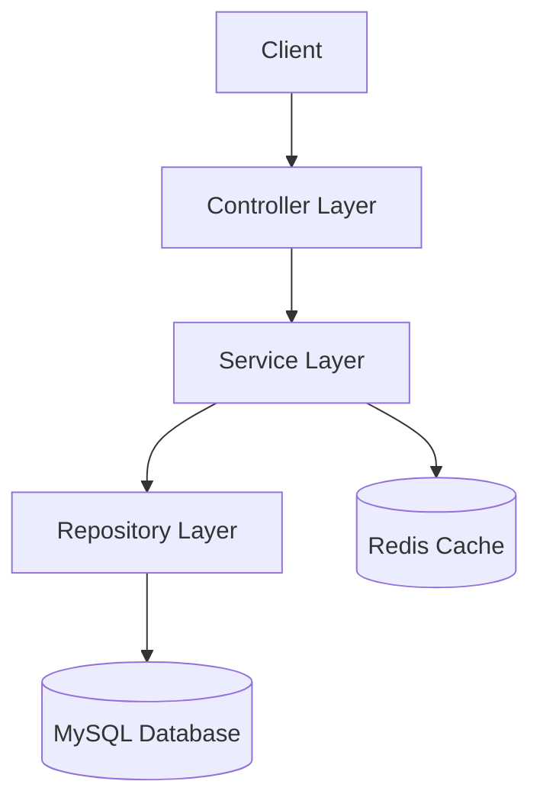
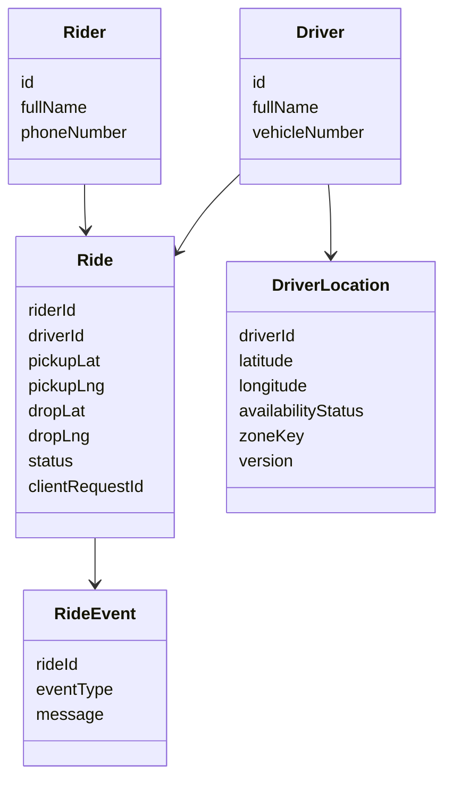
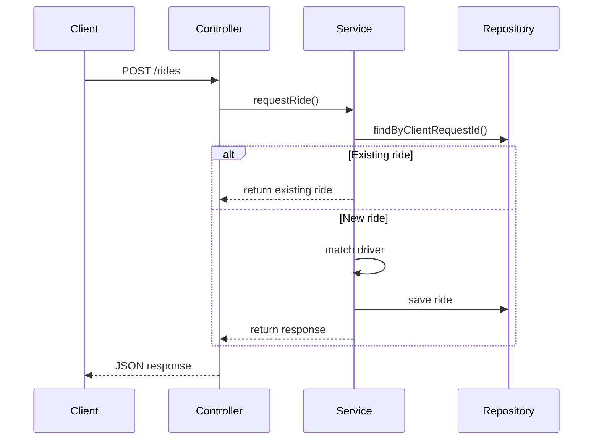

Here is your **final polished GitHub README** — clean, structured, and ready to paste directly into your repo.

---

# 🚖 Ride-Sharing Backend System

A production-style backend system for ride matching built using **Spring Boot, MySQL, Redis, Flyway, and Docker**.
This project demonstrates **scalable backend design, concurrency control, idempotent APIs, caching, and load-tested performance**.

---

## 🚀 Tech Stack

* **Backend:** Java 17, Spring Boot 3
* **Database:** MySQL 8
* **Cache:** Redis
* **ORM:** Hibernate / JPA
* **Migrations:** Flyway
* **Testing:** JUnit 5
* **Load Testing:** k6
* **Infrastructure:** Docker Compose

---

## 🧩 Features

* 🚖 Ride request and driver matching
* 👤 Driver & rider registration APIs
* 📍 Real-time driver location updates
* ⚡ Nearest-driver matching algorithm
* 🔒 Concurrency-safe driver assignment
* 🔁 Idempotent ride creation using `clientRequestId`
* ⚡ Redis caching for active drivers
* 📊 Database indexing and query optimization
* 🧪 Load-tested APIs with k6

---

## 🏗️ Architecture

```text
Client → Controller → Service → Repository → Database (MySQL)
                                   ↓
                                Cache (Redis)
```

---

## 📐 UML Diagrams

### 🔹 High-Level Architecture



---

### 🔹 Class Diagram



---

### 🔹 Ride Request Flow



---

## ⚙️ Getting Started

### 1. Clone Repository

```bash
git clone https://github.com/YOUR_USERNAME/rideshare-backend.git
cd rideshare-backend
```

---

### 2. Start Infrastructure

```bash
docker compose up -d
```

Services:

* MySQL → `localhost:3306`
* Redis → `localhost:6379`
* Adminer → [http://localhost:8081](http://localhost:8081)

---

### 3. Run Application

```bash
./mvnw spring-boot:run
```

---

### 4. Health Check

```bash
curl http://localhost:8080/actuator/health
```

---

## 📡 API Examples

### ➤ Register Driver

```bash
curl -X POST http://localhost:8080/api/v1/drivers \
-H "Content-Type: application/json" \
-d '{
  "fullName": "Amit Sharma",
  "phoneNumber": "9999999999",
  "vehicleNumber": "NYC-DR-101"
}'
```

---

### ➤ Update Driver Location

```bash
curl -X PUT http://localhost:8080/api/v1/drivers/1/location \
-H "Content-Type: application/json" \
-d '{
  "latitude": 40.712776,
  "longitude": -74.005974,
  "availabilityStatus": "AVAILABLE"
}'
```

---

### ➤ Register Rider

```bash
curl -X POST http://localhost:8080/api/v1/riders \
-H "Content-Type: application/json" \
-d '{
  "fullName": "Riya Patel",
  "phoneNumber": "8888888888"
}'
```

---

### ➤ Request Ride

```bash
curl -X POST http://localhost:8080/api/v1/rides \
-H "Content-Type: application/json" \
-d '{
  "riderId": 1,
  "pickupLatitude": 40.712700,
  "pickupLongitude": -74.005900,
  "dropoffLatitude": 40.730610,
  "dropoffLongitude": -73.935242,
  "clientRequestId": "req-001"
}'
```

---

## ⚡ Load Testing

### Run Test

```bash
k6 run load-tests/driver_location_update_test.js
```

---

### Test Configuration

* 5 virtual users
* 20 seconds
* ~100 requests

---

### Results

* Average latency: **~21 ms**
* p95 latency: **~27 ms**
* 100% valid responses (204 + 409)
* No crashes under concurrent updates

---

### Key Insight

Concurrent updates to the same driver cause **optimistic locking conflicts**, which are expected and handled using **HTTP 409 (Conflict)** instead of system failures.

---

## 🧠 Key Learnings

* Designing idempotent APIs
* Handling concurrency with optimistic locking
* Implementing cache-aside pattern with Redis
* Optimizing queries using indexing and EXPLAIN
* Performing load testing and interpreting results
* Designing correct HTTP error semantics

---

## 📌 Future Improvements

* Retry with exponential backoff
* Distributed locking (Redis / ZooKeeper)
* Geospatial indexing (GeoHash / PostGIS)
* Event-driven architecture (Kafka)
* Horizontal scaling

---
